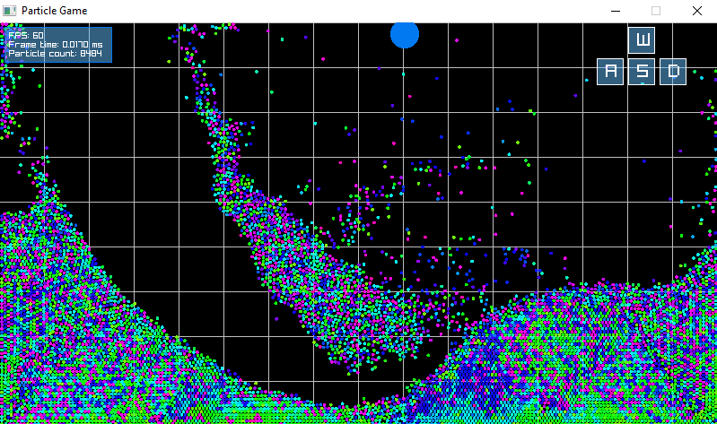

# Particle Game
A cross-platform real-time dynmaical particle system simulation built with Raylib.

## How to Play
* Mouse - move cursor to move emitor
* W - Emit/spawn particles into the scene from cursor. 
* S - Kill/despawn particles under cursor.
* A - Attract particles towards mouse cursor.
* D - Repulse particles away from mouse cursor.

# Basic Setup

Clone the repository with git, from the url
```
https://github.com/zackthomas1/particle-game.git
```

## Supported Platforms
Application supports the main 3 desktop platforms:
* Windows
* Linux
* MacOS

## Requirements
* OpenGL 3.3 support

# VSCode Users (all platforms)
*Note* You must have a compiler toolchain installed in addition to vscode.

1. Open the folder in VSCode
2. Run the build task ( CTRL+SHIFT+B or F5 )
3. You are good to go

# Windows Users
There are two compiler toolchains available for windows, MinGW-W64 (a free compiler using GCC), and Microsoft Visual Studio
## Using MinGW-W64
* Double click the `build-MinGW-W64.bat` file
* CD into the folder in your terminal
  * if you are using the W64devkit and have not added it to your system path environment variable, you must use the W64devkit.exe terminal, not CMD.exe
  * If you want to use cmd.exe or any other terminal, please make sure that gcc/mingw-W64 is in your path environment variable.
* run `make`
* You are good to go

### Note on MinGW-64 versions
Make sure you have a modern version of MinGW-W64 (not mingw).
The best place to get it is from the W64devkit from
https://github.com/skeeto/w64devkit/releases

## Microsoft Visual Studio
* Rename the folder to your game name
* Run `build-VisualStudio2022.bat`
* double click the `.sln` file that is generated
* develop your game
* you are good to go

# Linux Users
* Rename the folder to your game name
* CD into the build folder
* run `./premake5 gmake`
* CD back to the root
* run `make`
* you are good to go

# MacOS Users
* Rename the folder to your game name
* CD into the build folder
* run `./premake5.osx gmake`
* CD back to the root
* run `make`
* you are good to go

# Output files
The built code will be in the bin dir

**Compile**
```
mingw32-make
```

**Run**
```
.\bin\{configuration}\particle-game.exe
```

# raylib-game-template License
Copyright (c) 2020-2025 Jeffery Myers

This software is provided "as-is", without any express or implied warranty. In no event 
will the authors be held liable for any damages arising from the use of this software.

Permission is granted to anyone to use this software for any purpose, including commercial 
applications, and to alter it and redistribute it freely, subject to the following restrictions:

  1. The origin of this software must not be misrepresented; you must not claim that you 
  wrote the original software. If you use this software in a product, an acknowledgment 
  in the product documentation would be appreciated but is not required.

  2. Altered source versions must be plainly marked as such, and must not be misrepresented
  as being the original software.

  3. This notice may not be removed or altered from any source distribution.
